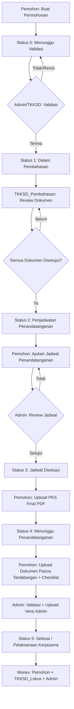
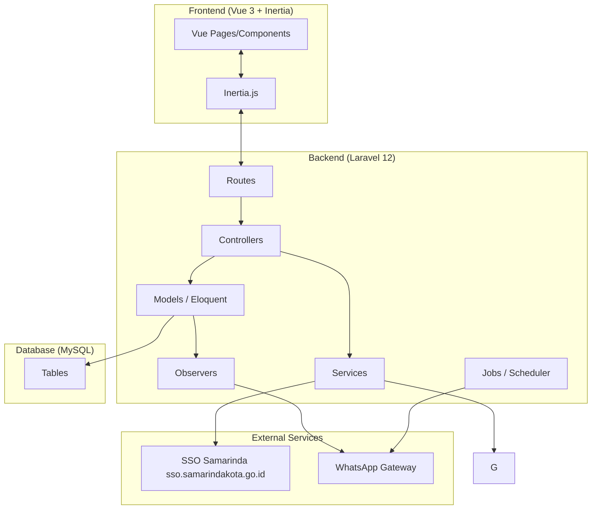
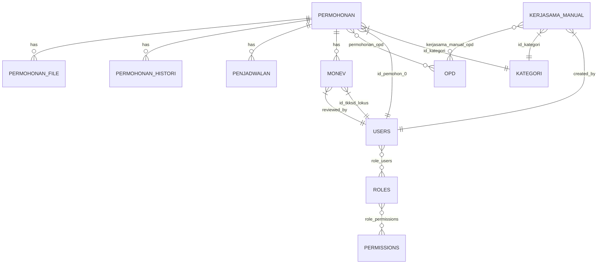

# Design Document: SiKerja V2 Workflow Overhaul

## Overview

SiKerja V2 (Sistem Informasi Kerjasama Daerah Kota Samarinda) adalah aplikasi berbasis web yang mengelola proses permohonan dan pelaksanaan kerjasama daerah. Overhaul ini mencakup 17 requirement yang terbagi dalam beberapa kategori besar:

1. **Bug Fix** — Perbaikan validasi tabel provinsi/kota yang salah referensi
2. **Workflow Enhancement** — Penambahan step baru pasca-pembahasan (upload PKS, dokumen pasca-tandatangan), perubahan metode penjadwalan, dan notifikasi yang lebih informatif
3. **Role Baru** — TKKSD_Lokus untuk monitoring & evaluasi
4. **Fitur Baru** — Template dokumen tetap, field OPD, rating monev, reminder otomatis, infografis publik, kerjasama manual, monev manual
5. **Auth** — Semua user (dalam maupun luar daerah) login via SSO `sso.samarindakota.go.id`. Tidak ada Google OAuth.

Stack teknologi: **Laravel 12 + Vue 3 + Inertia.js + TailwindCSS**

### Workflow Permohonan Baru (Target)



---

## Architecture

Aplikasi menggunakan arsitektur **Monolithic MVC** dengan Inertia.js sebagai jembatan antara Laravel (backend) dan Vue 3 (frontend), tanpa REST API terpisah.



### Prinsip Arsitektur

- **Controller Thin** — Logika bisnis kompleks (notifikasi, status transition) dipindahkan ke Service atau Observer
- **Observer Pattern** — `PermohonanObserver` menangani side effect perubahan status (notifikasi WA, histori)
- **Scheduled Jobs** — Reminder 3 bulan menggunakan Laravel Scheduler + Queue
- **Permission-based Access** — Semua aksi dikontrol via `can:permission.name` middleware, bukan role check langsung di controller
- **Inertia SSR-ready** — Semua data dikirim via `Inertia::render()` props, tidak ada AJAX terpisah kecuali untuk operasi real-time (diskusi file)

---

## Components and Interfaces

### Backend Controllers (Baru/Dimodifikasi)

| Controller | Status | Perubahan |
|---|---|---|
| `Auth/SSOController` | Modifikasi | Tambah auto-link OPD dari unit_kerja SSO ke `users.id_opd` |
| `PermohonanController` | Modifikasi | Fix validasi provinsi/kota, tambah submit ulang dari status 9, tambah upload PKS, upload pasca-tandatangan |
| `ValidasiController` | Modifikasi | Tidak ada perubahan signifikan |
| `PembahasanController` | Modifikasi | Tambah pencatatan identitas approver/rejector |
| `PenjadwalanController` | Modifikasi | Tambah field metode (desk-to-desk, ceremonial, hybrid), ubah notifikasi pasca-setujui |
| `MonevController` | Modifikasi | Tambah alur TKKSD_Lokus, form monev final Admin, rating, monev manual |
| `KerjasamaManualController` | Baru | CRUD kerjasama manual (Admin only) |
| `TemplateController` | Baru | Download template dokumen |
| `InfografisController` | Baru | Endpoint publik statistik kerjasama |
| `OpdController` | Baru | Master data OPD |
| `ReminderController` | Baru | Trigger manual reminder (opsional) |

### Backend Services (Baru/Dimodifikasi)

| Service | Deskripsi |
|---|---|
| `WhatsappService` | Sudah ada, tidak berubah |
| `NotifikasiService` | Baru — abstraksi pengiriman notifikasi (sistem + WA) |
| `WorkflowService` | Baru — mengelola transisi status permohonan dan validasi pre-condition |
| `ReminderService` | Baru — logika pengecekan dan pengiriman reminder kerjasama hampir berakhir |

### Frontend Pages (Baru/Dimodifikasi)

| Page | Status | Deskripsi |
|---|---|---|
| `Auth/Login.vue` | Tidak berubah | SSO tetap satu-satunya metode login |
| `Permohonan/Create.vue` | Modifikasi | Tambah step 3 field OPD (multi-select) |
| `Permohonan/Show.vue` | Modifikasi | Tambah section upload PKS, upload pasca-tandatangan, checklist |
| `Pembahasan/Index.vue` | Modifikasi | Tampilkan identitas approver/rejector per dokumen |
| `Penjadwalan/Index.vue` | Modifikasi | Tambah pilihan metode (desk-to-desk, ceremonial, hybrid) |
| `Monev/Create.vue` | Modifikasi | Tambah field rating, alur TKKSD_Lokus |
| `Monev/Show.vue` | Modifikasi | Tampilkan rating, status approval TKKSD_Lokus |
| `KerjasamaManual/Index.vue` | Baru | Daftar kerjasama manual |
| `KerjasamaManual/Create.vue` | Baru | Form input kerjasama manual |
| `Infografis/Index.vue` | Baru | Halaman publik infografis (tanpa auth) |
| `Master/Opd/Index.vue` | Baru | Master data OPD |

### Scheduled Jobs

| Job | Jadwal | Deskripsi |
|---|---|---|
| `SendKerjasamaReminderJob` | Daily (setiap hari) | Cek kerjasama yang berakhir dalam 90 hari, kirim notifikasi ke OPD, Perangkat Daerah, dan Admin |

---

## Data Models

### Perubahan Model Existing

#### `Permohonan` — Tambah Status Baru dan Field

```php
// Status constants baru
const STATUS_PERMOHONAN = 0;          // Menunggu Validasi
const STATUS_PEMBAHASAN = 1;          // Dalam Pembahasan
const STATUS_PENJADWALAN = 2;         // Penjadwalan Penandatanganan
const STATUS_JADWAL_DISETUJUI = 3;    // Jadwal Disetujui, menunggu upload PKS
const STATUS_MENUNGGU_TANDATANGAN = 4; // PKS diupload, menunggu penandatanganan
const STATUS_PASCA_TANDATANGAN = 5;   // Dokumen pasca-tandatangan diupload
const STATUS_PELAKSANAAN = 6;         // Kerjasama aktif berjalan (sebelum tanggal_berakhir)
const STATUS_SELESAI = 7;             // Selesai (tanggal_berakhir kerjasama sudah lewat)
const STATUS_DITOLAK = 9;             // Ditolak

// Field baru di tabel permohonan
'file_pks'              // path file PKS final (PDF)
'file_pks_uploaded_at'  // timestamp upload PKS
'file_pasca_tandatangan' // path file pasca-tandatangan
'checklist_paraf'       // boolean
'checklist_materai'     // boolean
'checklist_stempel'     // boolean
'file_admin_version'    // path file versi Admin
```

#### `Penjadwalan` — Tambah Field Metode

```php
// Field baru di tabel penjadwalan
// Field 'tipe' yang sudah ada diubah nilainya:
// Sebelum: 'calendar', 'langsung'
// Sesudah: 'desk_to_desk', 'ceremonial', 'hybrid'
```

#### `Monev` — Tambah Field Rating dan Tipe

```php
// Field baru di tabel monevs
'rating'        // integer 1-5
'tipe'          // enum: 'reguler', 'manual'
'id_tkksd_lokus' // foreign key ke users (TKKSD_Lokus yang mereview)
'tkksd_approved_at' // timestamp persetujuan TKKSD_Lokus
'tkksd_catatan'  // catatan dari TKKSD_Lokus
```

### Model Baru

#### `Opd` — Master Data OPD

```php
// Tabel: opd
Schema::create('opd', function (Blueprint $table) {
    $table->id();
    $table->string('kode', 20)->unique();
    $table->string('nama');
    $table->string('singkatan', 50)->nullable();
    $table->boolean('is_active')->default(true);
    $table->timestamps();
});
```

#### `PermohonanOpd` — Pivot Permohonan ↔ OPD

```php
// Tabel: permohonan_opd
Schema::create('permohonan_opd', function (Blueprint $table) {
    $table->id();
    $table->foreignId('id_permohonan')->constrained('permohonan')->cascadeOnDelete();
    $table->foreignId('id_opd')->constrained('opd')->cascadeOnDelete();
    $table->timestamps();
    $table->unique(['id_permohonan', 'id_opd']);
});
```

#### `KerjasamaManual` — Kerjasama Input Manual

```php
// Tabel: kerjasama_manual
Schema::create('kerjasama_manual', function (Blueprint $table) {
    $table->id();
    $table->uuid('uuid')->unique();
    $table->string('kode')->unique();
    $table->string('nama_instansi');
    $table->string('label'); // perihal kerjasama
    $table->foreignId('id_kategori')->constrained('kategori');
    $table->date('tanggal_mulai')->nullable();
    $table->date('tanggal_berakhir')->nullable();
    $table->string('jangka_waktu')->nullable();
    $table->text('ruang_lingkup')->nullable();
    $table->string('file_pks')->nullable(); // PDF PKS final
    $table->foreignId('created_by')->constrained('users');
    $table->timestamps();
    $table->softDeletes();
});
```

#### `KerjasamaManualOpd` — Pivot KerjasamaManual ↔ OPD

```php
// Tabel: kerjasama_manual_opd
Schema::create('kerjasama_manual_opd', function (Blueprint $table) {
    $table->id();
    $table->foreignId('id_kerjasama_manual')->constrained('kerjasama_manual')->cascadeOnDelete();
    $table->foreignId('id_opd')->constrained('opd')->cascadeOnDelete();
    $table->timestamps();
});
```

#### `DocumentTemplate` — Template Dokumen

```php
// Tabel: document_templates
Schema::create('document_templates', function (Blueprint $table) {
    $table->id();
    $table->string('kode', 50)->unique(); // 'surat_permohonan', 'kak', 'mou'
    $table->string('label');
    $table->string('format', 10); // 'pdf', 'docx'
    $table->string('file_path');
    $table->foreignId('updated_by')->nullable()->constrained('users');
    $table->timestamps();
});
```

### Perubahan Tabel Existing

#### `permohonan_histori` — Tambah Field Role Reviewer

```php
// Kolom baru
$table->string('reviewer_role')->nullable(); // role user saat melakukan aksi
```

#### `users` — Tambah Kolom `id_opd`

```php
// TKKSD Lokus adalah akun yang mewakili OPD tertentu
// Kolom baru di tabel users
$table->foreignId('id_opd')->nullable()->constrained('opd')->nullOnDelete();
```

#### `role_users` / `roles` — Role Baru

```
Role baru: tkksd_lokus
- slug: 'tkksd_lokus'
- name: 'TKKSD Lokus Kerjasama'
- Permissions: monev.menu, monev.view, monev.review.lokus

Konsep: TKKSD Lokus adalah akun user yang mewakili OPD.
Setiap OPD dapat memiliki satu atau lebih akun tkksd_lokus.
User tkksd_lokus hanya bisa melihat monev kerjasama yang OPD-nya
sesuai dengan id_opd mereka (scope per OPD).
```

**Scope akses monev untuk tkksd_lokus:**
```php
// MonevController::index()
if ($user->hasRole('tkksd_lokus') && $user->id_opd) {
    $query->whereHas('permohonan.opds', fn($q) => $q->where('opd.id', $user->id_opd));
}
```

**Manajemen akun OPD:**
- Admin membuat akun user baru, pilih role `tkksd_lokus`, lalu pilih OPD yang diwakili
- Di Settings > Users > Create/Edit: field "OPD" muncul kondisional saat role = `tkksd_lokus`

### Diagram Relasi Utama



---

## Correctness Properties

*A property is a characteristic or behavior that should hold true across all valid executions of a system — essentially, a formal statement about what the system should do. Properties serve as the bridge between human-readable specifications and machine-verifiable correctness guarantees.*

### Property 1: SSO Login Selalu Menghasilkan User dengan Role yang Tepat

*For any* valid SSO payload, proses login via SSO `sso.samarindakota.go.id` SHALL menghasilkan record user yang dibuat atau diperbarui dengan data dari SSO. Jika user memiliki `unit_id` yang cocok dengan OPD di tabel `opd`, maka `users.id_opd` SHALL diisi otomatis.

**Validates: Requirements 1.3**

---

### Property 2: SSO Login Tidak Pernah Membuat User Tanpa Role

*For any* valid SSO payload, user yang berhasil login SHALL selalu memiliki minimal satu role yang ditetapkan — tidak pernah tanpa role.

**Validates: Requirements 1.3**

---

### Property 3: Validasi Provinsi Menggunakan Tabel yang Benar

*For any* id_provinsi yang valid di tabel `master_provinces`, validasi form permohonan SHALL lolos; dan untuk sembarang id yang tidak ada di `master_provinces`, validasi SHALL gagal dengan error yang sesuai.

**Validates: Requirements 2.1**

---

### Property 4: Validasi Kota Menggunakan Tabel yang Benar

*For any* id_kota yang valid di tabel `master_cities`, validasi form permohonan SHALL lolos; dan untuk sembarang id yang tidak ada di `master_cities`, validasi SHALL gagal dengan error yang sesuai.

**Validates: Requirements 2.2**

---

### Property 5: Submit Ulang Permohonan Ditolak Mereset Status

*For any* permohonan dengan status = 9 (ditolak), ketika Pemohon melakukan edit dan submit ulang, status permohonan SHALL berubah menjadi 0 (Permohonan Baru) — tidak pernah status lain.

**Validates: Requirements 2.3**

---

### Property 6: Setiap Aksi Review Dokumen Mencatat Identitas Lengkap

*For any* aksi approve atau reject dokumen oleh TKKSD_Pembahasan, record yang dibuat di `permohonan_histori` SHALL mengandung id_operator, reviewer_role, dan timestamp — tidak boleh ada satu pun field yang null.

**Validates: Requirements 4.1, 4.2, 4.4**

---

### Property 7: Metode Penjadwalan Tersimpan dengan Benar

*For any* pilihan metode penjadwalan yang valid (desk_to_desk, ceremonial, hybrid), nilai yang disimpan di field `tipe` pada tabel `penjadwalan` SHALL identik dengan nilai yang dipilih oleh Pemohon.

**Validates: Requirements 6.3**

---

### Property 8: Upload PKS Hanya Menerima PDF

*For any* file yang diupload sebagai PKS final, sistem SHALL menolak file dengan ekstensi selain `.pdf` dan SHALL menerima file dengan ekstensi `.pdf` yang valid.

**Validates: Requirements 7.2**

---

### Property 9: Berkas Lama Terkunci Setelah Melewati Tahap Pembahasan

*For any* permohonan dengan status > 1 (sudah melewati pembahasan), upaya Pemohon untuk mengubah atau menghapus berkas yang diupload pada tahap pembahasan SHALL ditolak dengan HTTP 403.

**Validates: Requirements 7.3**

---

### Property 10: Validasi Checklist Pasca-Tandatangan Bersifat Ketat

*For any* kombinasi checklist yang tidak lengkap (paraf, materai, atau stempel belum dicentang), upload dokumen pasca-tandatangan SHALL ditolak; hanya ketika ketiga item dicentang, upload SHALL diizinkan.

**Validates: Requirements 9.3**

---

### Property 11: TKKSD_Lokus Tidak Dapat Mengakses Modul Selain Monev

*For any* route yang bukan bagian dari modul monev, request dari user dengan role tkksd_lokus SHALL mendapat respons HTTP 403; dan untuk route monev, request SHALL diizinkan.

**Validates: Requirements 11.2**

---

### Property 12: Relasi Permohonan-OPD Tersimpan dan Dapat Diambil Kembali

*For any* set OPD yang dipilih pada form permohonan (satu atau lebih), setelah permohonan disimpan, query relasi permohonan-OPD SHALL mengembalikan set OPD yang identik dengan yang dipilih — tidak lebih, tidak kurang.

**Validates: Requirements 12.2**

---

### Property 13: Rating Monev Tersimpan dengan Benar

*For any* nilai rating integer antara 1 dan 5 (inklusif), nilai yang disimpan di field `rating` pada tabel `monevs` SHALL identik dengan nilai yang diinput oleh Admin.

**Validates: Requirements 13.2**

---

### Property 14: Reminder Dikirim ke Semua Pihak untuk Kerjasama yang Hampir Berakhir

*For any* kerjasama (permohonan atau kerjasama manual) dengan `tanggal_berakhir` yang jatuh dalam 90 hari ke depan, ketika scheduler dijalankan, notifikasi reminder SHALL dikirim ke OPD terkait, Perangkat Daerah terkait, dan Admin — tidak boleh ada satu pihak pun yang terlewat.

**Validates: Requirements 14.1, 14.2, 14.3**

---

## Error Handling

### Strategi Umum

Semua error handling mengikuti pola Laravel yang sudah ada di proyek:
- **Validation Error** → `redirect()->back()->withErrors()` atau JSON `422` untuk AJAX
- **Authorization Error** → `abort(403)` dengan pesan yang informatif
- **Not Found** → `firstOrFail()` yang otomatis throw `ModelNotFoundException` → HTTP 404
- **Server Error** → Log ke `storage/logs/laravel.log`, tampilkan halaman error generic

### Error Handling per Fitur

#### Auth (SSO)
- Jika SSO tidak merespons → tampilkan pesan "Layanan SSO sedang tidak tersedia, coba lagi nanti"
- Semua login melalui SSO `sso.samarindakota.go.id` — tidak ada metode login lain

#### Workflow Permohonan
- Jika Pemohon mencoba upload PKS saat status belum `STATUS_JADWAL_DISETUJUI` → `abort(403, 'Jadwal belum disetujui')`
- Jika Pemohon mencoba upload pasca-tandatangan tanpa checklist lengkap → validasi error dengan pesan per item checklist
- Jika Admin mencoba approve PKS saat dokumen belum diupload → validasi error

#### Upload File
- File melebihi 10MB → validasi error `max:10240`
- Format file tidak sesuai → validasi error `mimes:`
- Storage penuh → catch `Exception`, log error, tampilkan pesan "Gagal menyimpan file, hubungi administrator"

#### Notifikasi WhatsApp
- WA Gateway tidak merespons → catch `Exception`, log error, lanjutkan proses (notifikasi WA bersifat best-effort, tidak boleh memblokir workflow)
- Nomor telepon tidak ditemukan → skip pengiriman WA, tetap kirim notifikasi sistem internal

#### Reminder Scheduler
- Jika job gagal → Laravel Queue retry mechanism (max 3 kali), setelah itu masuk `failed_jobs`
- Jika kerjasama tidak memiliki OPD terkait → skip pengiriman ke OPD, tetap kirim ke Admin

---

## Testing Strategy

### Pendekatan Dual Testing

Proyek ini menggunakan dua lapisan testing yang saling melengkapi:

1. **Unit/Feature Tests** — Verifikasi contoh spesifik, edge case, dan kondisi error
2. **Property-Based Tests** — Verifikasi properti universal yang harus berlaku untuk semua input valid

### Library Property-Based Testing

Proyek menggunakan PHP, sehingga library yang dipilih adalah **[Eris](https://github.com/giorgiosironi/eris)** (PHP property-based testing library) atau alternatifnya **[PHPCheck](https://github.com/igorw/phpcheck)**. Setiap property test dikonfigurasi untuk minimum **100 iterasi**.

Format tag untuk setiap property test:
```
// Feature: sikerja-v2-workflow-overhaul, Property {N}: {property_text}
```

### Unit & Feature Tests (PHPUnit)

Fokus pada:
- Contoh spesifik alur workflow (happy path dan error path)
- Integrasi antar komponen (Controller → Service → Model)
- Edge case yang tidak tercakup property test
- Verifikasi notifikasi dikirim dengan konten yang benar

Contoh test cases prioritas:
- `test_pemohon_can_resubmit_rejected_permohonan` — verifikasi alur revisi
- `test_admin_can_approve_pks_and_status_changes` — verifikasi transisi status
- `test_reminder_job_sends_to_all_three_parties` — verifikasi reminder 3 pihak
- `test_public_infografis_accessible_without_auth` — verifikasi endpoint publik
- `test_tkksd_lokus_cannot_access_permohonan_routes` — verifikasi access control

### Property-Based Tests

Setiap property dari bagian Correctness Properties diimplementasikan sebagai satu property test:

| Property | Test Method | Generator |
|---|---|---|
| P1: SSO role mapping | `test_sso_login_assigns_correct_role` | Random SSO payloads dengan berbagai unit_kerja |
| P2: Google OAuth role | `test_google_oauth_always_assigns_pemohon_role` | Random Google OAuth payloads |
| P3: Validasi provinsi | `test_province_validation_uses_master_provinces` | Random valid/invalid province IDs |
| P4: Validasi kota | `test_city_validation_uses_master_cities` | Random valid/invalid city IDs |
| P5: Reset status ditolak | `test_resubmit_rejected_resets_to_status_zero` | Random permohonan dengan status=9 |
| P6: Identitas reviewer | `test_review_action_records_complete_identity` | Random approve/reject actions |
| P7: Metode penjadwalan | `test_scheduling_method_stored_correctly` | Random method selections |
| P8: PKS hanya PDF | `test_pks_upload_only_accepts_pdf` | Random file types |
| P9: Berkas terkunci | `test_old_files_locked_after_pembahasan` | Random permohonan dengan status > 1 |
| P10: Checklist ketat | `test_post_signing_upload_requires_all_checklist` | Random checklist combinations |
| P11: TKKSD_Lokus access | `test_tkksd_lokus_restricted_to_monev_only` | Random non-monev routes |
| P12: Relasi OPD | `test_permohonan_opd_relation_round_trip` | Random OPD sets |
| P13: Rating monev | `test_monev_rating_stored_correctly` | Random integers 1-5 |
| P14: Reminder 3 pihak | `test_reminder_sent_to_all_parties` | Random kerjasama dengan tanggal hampir berakhir |

### Integration Tests

Untuk fitur yang melibatkan external service atau infrastruktur:
- **SSO Integration** — 1-2 test dengan mock SSO response
- **WhatsApp Gateway** — Mock `WhatsappService`, verifikasi method dipanggil dengan parameter yang benar
- **Scheduler** — Test bahwa `SendKerjasamaReminderJob` terdaftar di schedule dengan frekuensi daily

### Smoke Tests

- Verifikasi role `tkksd_lokus` ada di database setelah seeder dijalankan
- Verifikasi template dokumen tersedia di storage
- Verifikasi halaman infografis publik dapat diakses tanpa login
